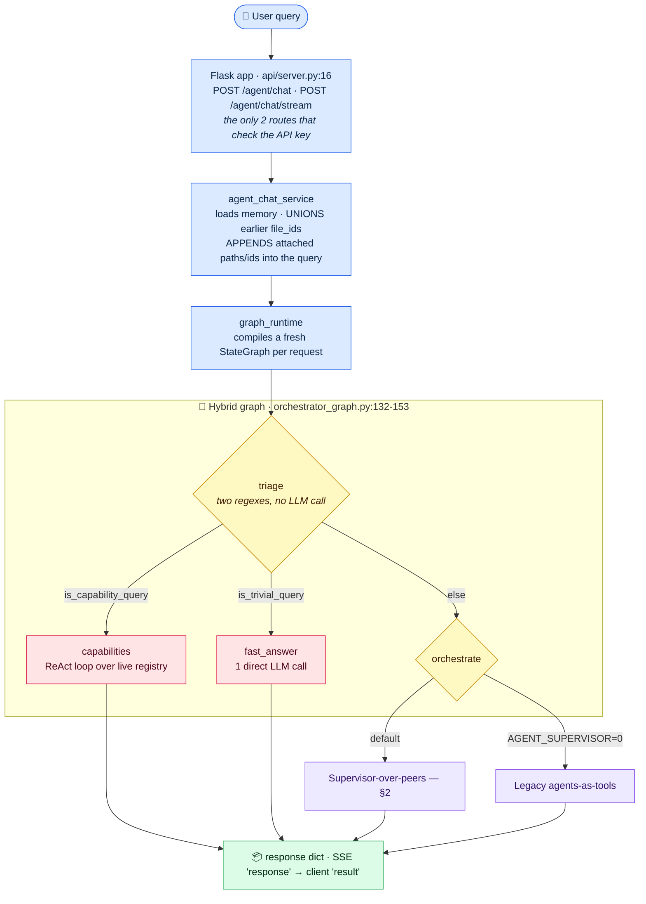
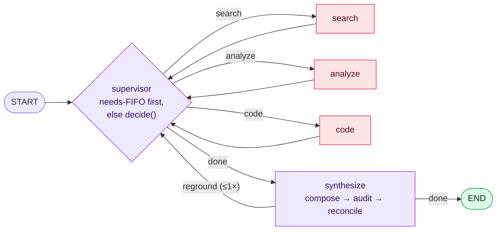

# I-GUIDE Agent — Architecture (as built)

A **hybrid LangGraph system**. One thin graph triages every request: self-referential
"what can you do" goes to a **capability** agent, trivial chatter is **fast-pathed** with a
single LLM call, and everything else goes to the **supervisor-over-peers** graph, where
**search / analyze / code** are same-level peers over one typed state, an LLM supervisor loops
over them, peers can **request** capabilities they lack, and a **synthesize** step composes and
then *grounds* the answer. A legacy agents-as-tools path survives behind `AGENT_SUPERVISOR=0`.

> **Every claim here is anchored to `file:line`.** This document was regenerated on
> 2026-09-02 after the previous version drifted far enough to be actively misleading — it
> described a dispatch shape, prompt, checkpointer and middleware count that no longer existed,
> and was silent on the action ledger, the context budget and the grounding gate. If you change
> behaviour, change the anchored line here or delete it. **An unanchored claim in this file
> should be treated as suspect**, and §8 lists the contradictions known at time of writing.

---

## 1 · Request lifecycle & dispatch



- **Triage is deterministic and free** — two regexes, decided before either trace event is
  emitted (`orchestrator_graph.py:132-153`). `is_trivial_query` must match the *whole* message
  (`:49-72`), so "hi, now map the floodplain" is not trivial. `is_capability_query` runs first,
  so `"what can you do"` — which both regexes match — routes to capabilities
  (`capabilities.py:38-51`).
- **The graph never sees the raw query when files are attached.** `agent_chat_service` appends a
  block of paths and `file_id (filename)` lines plus `execute_code` instructions, and passes
  *that* as `query` (`agent_chat_service.py:143-152,166-187`). Consequence: any attachment
  defeats the trivial path.
- **File ids accumulate per thread.** Earlier turns' ids are unioned into this turn's
  (`agent_chat_service.py:302,470`, `session_memory.py:146-163`), so "run it on that CSV" works
  without the client resending the id.
- **Auth is opt-in.** `_require_agent_chat_api_key` returns immediately when
  `AGENT_CHAT_API_KEY` is unset (`api/server.py:58-64`) and is called from only two places
  (`:1412,:1913`). Upload, download, `/query`, `/query/batch`, `/agent/models` and
  `/agent/dashboard` are **unauthenticated** regardless.
- **Field names are dual-cased**, camelCase winning, via one normalizer
  (`api/server.py:71-152`); only `userQuery`/`user_input` is required. Four fields are
  deliberately tri-state — `includeMcpTools`, `agentDev`, `useSupervisor`, `codeExec` — where
  *absent* means "use the env default" and `false` means false (`:79-104`).
- **`smart_tool_routing` and `forced_intent`** are still plumbed end-to-end
  (`api/server.py:87-88,136-137`) but only the legacy arm reads them: they are **inert** under
  the default supervisor. Same for `tool_policy.select_allowed_tools`
  (`tool_policy.py:26-58`), whose only callers are `legacy/graph_nodes.py:60` and the intent
  classifier.
- Old import paths still resolve through `sys.modules` aliases
  (`rag_pipeline/agent_chat_service.py:1-5`, `agent_runtime/supervisor_graph.py:7-9`), so a
  stale-looking module path is **not** evidence of a stale code path.

---

## 2 · The supervisor loop



Five nodes, `START → supervisor`, peers looping back, and **two** conditional edges
(`graph.py:3957-3980`). `ALLOWED_ACTIONS = ("search","analyze","code","done")` and `done` maps
to `synthesize` (`:52`).

**`synthesize` is no longer terminal.** Its edge is conditional on `state["reground"]` — the
grounding gate in §5 can send exactly one pass back through the supervisor. Anything that
assumes `synthesize → END` is out of date.

**The supervisor consults `decide()` only when the needs queue is empty**
(`graph.py:3575-3612`). A peer returning `{"needs": [...]}` gets that capability run *before*
the decider is asked again — which is exactly why the grounding gate enqueues a need rather than
relying on an edge: the decider is what already said `done`.

### Bounds — all of them

| Bound | Value | Where |
|---|---|---|
| Supervisor steps | `DEFAULT_MAX_STEPS = 8` | `graph.py:53` |
| Runs of any one peer | `AGENT_SUPERVISOR_MAX_PEER_RUNS`, **3** | `graph.py:64-68` |
| Search attempts | `_max_searches()` | `graph.py:56` |
| Re-grounding passes | `_MAX_GROUNDING_RETRIES = 1` | `graph.py:815` |
| Dead-need filter | unknown cap, exhausted search, per-peer cap | `graph.py:3583-3595` |
| No-progress backstop | a peer that just produced a result is not re-run back-to-back | `graph.py:3618` |
| Unified-peer floor | if nothing has run at all, force `analyze` (a **veto**, not a hint) | `graph.py:3633` |

`unified_peer_enabled()` (`graph.py:2819-2830`) is per-request with an env fallback, off by
default; turning it on merges search into analyze — and thereby bypasses everything living only
in `search_node`.

---

## 3 · Peers & tools

**There is no single tool registry.** Only the search peer goes through
`tool_policy.collect_tools` (`tool_policy.py:65`); analyze and code assemble their lists
inline from ~12 independently imported factories, each in its own `try/except`, so a missing
optional dependency costs only that family (`graph.py:2916-3040`). `build_agent_executor` passes
`preloaded_tools` straight to `create_agent`, topping up only absent skill tools
(`executor_factory.py:1599-1653`).

Measured on this checkout (code-exec on, `qgis_process` present without PyQGIS, 3 skills found):

| Peer | Tools bound | With a vector upload |
|---|---|---|
| search | 24 (36 with MCP) | — |
| analyze | 30 | 64 · 42 in unified mode |
| code | 24 | 54 |

Families: retrieval (KB/semantic/keyword/graph/web), `admin_boundary`, geocoding, QGIS, the
spatial toolkit (overlay 7 · aggregate 6 · temporal 5 · spatial-stats 7), `rs-embed` (7),
code execution, file tools, skills, MCP.

**Four gates change the bound set**: uploads (`input_file_ids`), a narrower tabular-only
refinement that withholds the four tools needing a *vector file* when every upload is a
spreadsheet (`graph.py:695-727`), the `enabled_search_methods` allowlist, and
`AGENT_CODE_EXEC` / `include_mcp_tools`. `rs-embed`, `admin_boundary`, geocode and
`add_map_layer` are deliberately **ungated**.

**Capability introspection is fully dynamic** (`capabilities.py`): `_discover_registry_factories`
globs `agent_runtime/*_tools.py` for `make_*tools` callables, and `list_my_capabilities(area,
topic)` walks that live registry — 17 factories / 16 areas / 70 distinct tools here. There is no
hardcoded capability prose in the answer path, so a new `*_tools.py` module is discoverable
without touching this code.

---

## 4 · What the answerer and the auditor each see

They are given **deliberately different** views, and the asymmetry is the design:

| | Answerer | Auditor |
|---|---|---|
| Evidence | 8 docs × 2500 chars | same 8 × 2500 |
| This turn's execution | ≤2000 chars per peer result | **8000** chars per peer result, bulk numerics elided |
| Action ledger (earlier turns) | yes, as its own prompt section | same rendering |
| Map client affordances | no — its map instruction comes from `SYNTHESIS_PROMPT` | yes, only when a layer really landed |

The **action ledger** is one row per tool *invocation*, call and result merged, paired by
`tool_call_id` first and only then positionally within the same tool name
(`graph.py:433,561-590`); shown 25 rows / `AGENT_LEDGER_MAX_CHARS` 6000 (`:341-345`). It is what
lets a follow-up be answered from an earlier turn's parameters — and both consumers get the
*same* rendering, which is the property to preserve.

The execution record is compacted before rendering (`evidence_quality.py:405-491`): a numeric
structure under `coordinates`/`embedding`/`vector`/… is replaced by its shape **only when it
holds more than 32 numbers**, so a Point's 2 coordinates and a 4-number bbox — which answers
quote verbatim — survive; JSON-string tool content is parsed first, or the walk never reaches
the coordinates; and an over-cap section is cut at **both** ends.

---

## 5 · Grounding: reconcile, then gate

`audit_answer_grounding` demands a claim ledger with a **verbatim 5–25-word span** per claim
before any verdict (`evidence_quality.py:271-341`) and never raises — a missing input yields a
benign verdict, an LLM error yields severity `unknown` (`evidence_quality.py:555`). Only `severity == "high"`
is surfaced.

Then **four deterministic drops** remove auditor false positives (`graph.py:1449-1456`):

1. an artifact dispute when an artifact *was* produced;
2. a numeric dispute when every disputed number appears in the execution record;
3. a verdict whose own stated reason concedes grounding;
4. a **map claim** when a layer really reached the map — including *affordance* claims ("you can
   pan, zoom, click"), which no tool result can ever evidence.

Map delivery has exactly one authority, `_map_delivered_this_turn` (`graph.py:1343`): it asks
the delivery boundary per tool result and **requires the tool to have succeeded**, reading only
`tool_results` entries and never a bare `on_map` — which is what stops the supervisor's own
conclusion from proving itself.

**Whatever survives all four drops routes back once.** `_reground_target` (`graph.py:857`)
picks the corrective by *how the answer was produced*: computed (`analysis_results`/`code_result`
present) → `analyze`; retrieved → `search`. The peer is told which claims were absent from every
tool result and that finishing the computation *or* saying it could not are both acceptable.
Bounded by the retry counter, the step budget, the per-peer cap and search exhaustion; when the
second pass is still flagged the answer ships with the caveat as before.

---

## 6 · Cross-cutting runtime (`executor_factory.py`)

Every agent is a `create_agent` graph with the same three middlewares. **The first entry is the
OUTERMOST wrapper**, so ordering is load-bearing and lives in one named function
(`_default_middleware`):

```
repair_history  →  budget_context  →  instrument
(outermost)                            (innermost — sees the payload as sent)
```

**Context budget.** The ceiling is derived *per request*: `window − output reserve − overhead`,
where overhead is the measured system prompt **plus** every tool schema — neither of which
appears in `request.messages` (langchain prepends them downstream). Trimming keeps the last
`HumanMessage` as an anchor, walks back from the newest, re-emits in original order, then
repairs orphaned tool calls. `AGENT_CONTEXT_BUDGET_TOKENS` unset/0 = derive, negative = disable.
Message estimates carry a ×1.8 markup (`AGENT_CONTEXT_PAYLOAD_SAFETY`) because `chars/4`
undercounts coordinate-dense payloads.

**Model windows are configured, not detected** — no provider here reports one. Every number was
measured by sending an oversized request and reading the provider's rejection: `gpt-4.1`
1,047,576 · `gpt-5.6-*`/`gpt-5.5`/`gpt-5.4` 922,000 · `gpt-5`/`-mini`/`-nano`/`gpt-5.2`/
`gpt-5.4-mini` 272,000 · `o3`/`o4-mini` 200,000 · `gpt-4o` 128,000 · `gpt-oss` 65,536. Sizes do
**not** follow version order, so prefix order matters (`gpt-5.4-mini` must precede `gpt-5.4`),
and the bare `gpt-5` entry sits last with the *smaller* tier. An unlisted id takes the 65,536
floor and warns once. `claude- → 200,000` is the one entry never measured.

**Per-turn instrumentation** logs two greppable JSON lines: `turn_instrumentation_toolset` once
per distinct bound set with per-tool schema cost, and `turn_instrumentation` per model call with
`session`+`seq`, peer, tools **bound vs called**, the estimate split three ways, and the
provider's real `input_tokens`. A *rejected* call logs too, with `error`. `session` is the
conversation id, **not** a turn — order by `seq`; a turn boundary shows as `messages` dropping.

**Peer threads are checkpointed; the supervisor graph is not.** `builder.compile()` takes no
checkpointer (`graph.py:3980`) while every peer executor gets the process-global
`DEFAULT_CHECKPOINTER` under a stable child id `{thread_id}::{label}`
(`executor_factory.py:106,1594`). This asymmetry is why `PeerSession` turn-scopes what a
verifier may read: without it, a tool call from turn 1 makes turn 2 look as if it ran.

---

## 7 · Deployment & code execution

Four services on `iguide-network` (`docker-compose.yml:13-160`): `embedding-server` (5000),
`mcp-server` (8000), **`agent-api` (host 3500 → container 5002)**, and
`metadata-extraction-server` (5001, `profiles: ["ingestion"]`, so not started by a plain
`up`). Startup is gated on real healthchecks.

- **Source is baked into the image**, not bind-mounted — `COPY rag_pipeline/ agent_runtime/
  api/ MCP_server/ extractors/` (`rag_pipeline/Dockerfile:58-64`); the only agent-api volumes
  are `agent_chat_files`, the Docker socket and `/tmp/iguide_codeexec`. **`scp` + `restart`
  deploys nothing: use `up -d --build`, then confirm with `docker exec agent-api grep …`.**
- **Code execution is Docker-out-of-Docker**: the image ships `docker-ce-cli` only and mounts
  the host socket. The run phase is `--network none --read-only --cap-drop ALL
  --security-opt no-new-privileges`, memory 4g, cpus 2.0, pids 256, writable only in `/work`
  and a 64 MB `/tmp`. **The pip phase passes no `--network`** and therefore has egress — reason
  about the two phases separately.
- `AGENT_CODE_EXEC` defaults **on**. The pre-baked `iguide-codeexec` image ships ~20 scientific
  and geospatial packages, and what it ships is **probed** at runtime, not declared — adding a
  package to `sandbox/Dockerfile` needs no matching declaration. Installs are pinned to the
  image's own versions to stop a warm dependency cache becoming an ABI mismatch.
- **One worker, unenforced.** `WEB_CONCURRENCY=1` is expressed only in compose and
  `.env.example`; nothing in Python reads it and there is no `gunicorn.conf.py`. The constraint
  is real — `DEFAULT_CHECKPOINTER` and `session_memory` are process-local — and `--threads 4`
  means four concurrent turns already share the process.
- **`user: root`** on agent-api (`docker-compose.yml:117`) overrides the image's `appuser`, and
  the mounted socket is root-equivalent control of the host daemon. Not for a shared host.

---

## 8 · Known gaps and contradictions (as of 2026-09-02)

Recorded so the next reader does not have to rediscover them:

1. ~~`code_execution.py:17` docstring~~ — **fixed 2026-09-03**; it now says "defaults to ON",
   matching `is_code_exec_enabled()` (`:288-291`).
2. **Filesystem skills are enabled by default but discover nothing in the deployed image** —
   `skills/` and `.agents/` are not in the `COPY` list, and `.dockerignore` excludes `*.md`.
   Works in a dev checkout, silently absent in production.
3. **Nothing enforces the single-worker contract** (see §7).
4. **No admission control on sandbox containers** — four concurrent turns can each hold a 4g
   exec container with no semaphore anywhere.
5. **`graph_state.py:26-47` name sets are stale** relative to the live tool surface; they feed
   only the inert `select_allowed_tools`.
6. ~~The re-grounding directive reaches only `default_analyze_fn`~~ — **fixed 2026-09-03**.
   This was mis-filed as latent: `_reground_target` routes to `search` whenever the answer was
   retrieved rather than computed, so the retrieval-side pass really was running blind. Both
   peers now read `_reground_note`, pinned by a test. The CODE peer still does not, and is not
   a target today.
7. **`requirements.txt` pins nothing exactly** — two builds of one commit can differ.
8. **The overhead estimate overstates tool schemas ~1.35×** (measured), so the derived ceiling
   is slightly tighter than necessary. Deliberately not "fixed": the decomposition rests on two
   data points whose admissible fits imply opposite edits, and post-window-fix it is ~0.3% of
   the deployed model's window.

### Legend

`§n` cross-references a section above. `file:line` anchors are to this repository at the commit
that introduced them; if a line has moved, grep the symbol rather than trusting the number.
