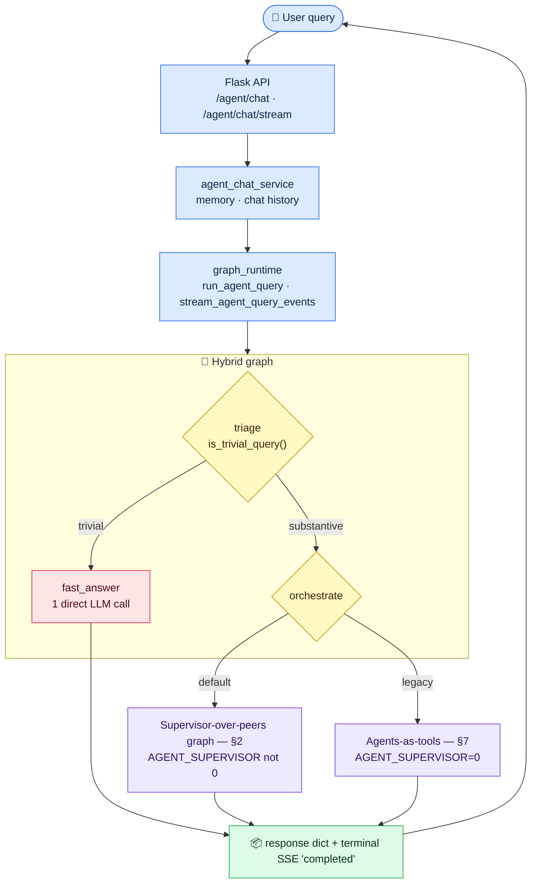
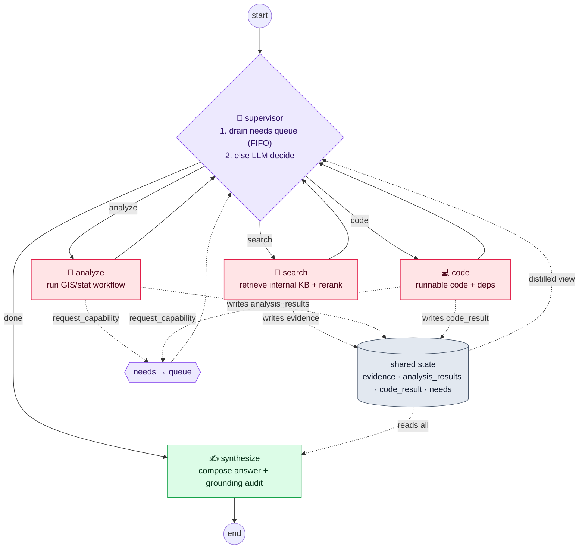
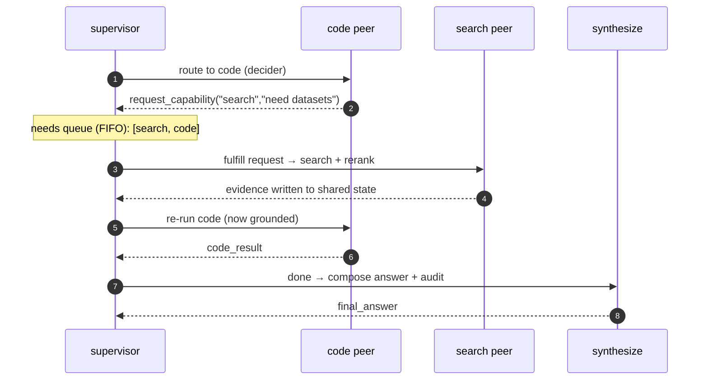
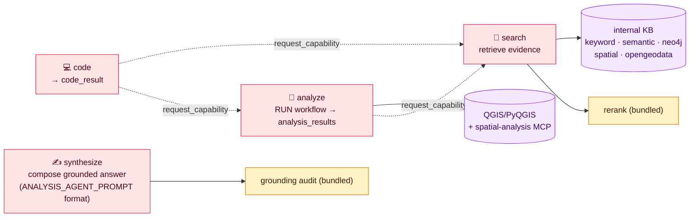
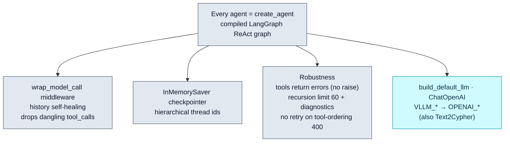
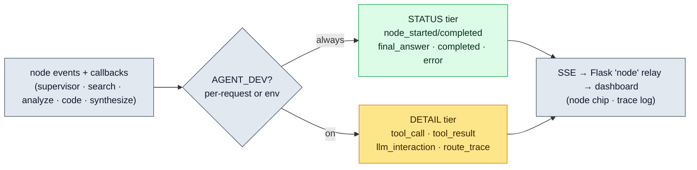
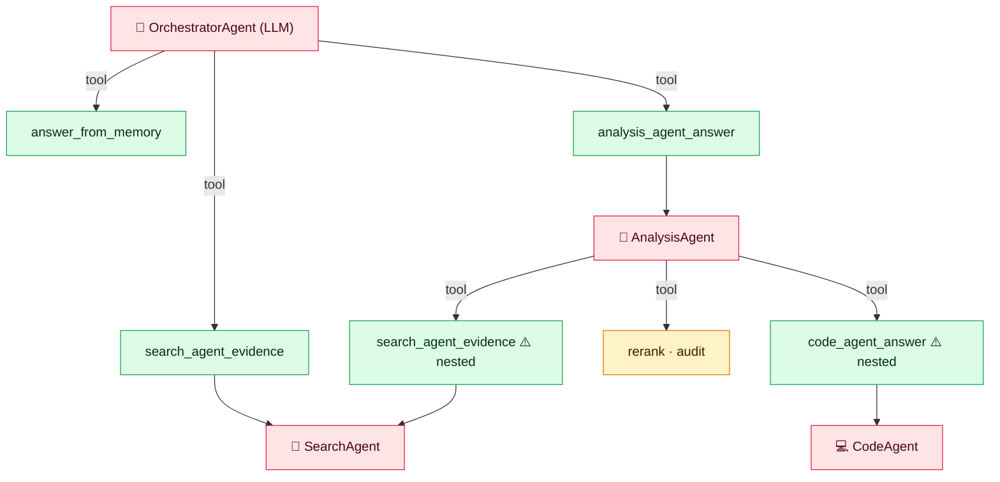

# I-GUIDE Agent — Architecture (as built)

A **hybrid LangGraph system**. A thin graph triages each request: trivial inputs are
**fast-pathed** (one direct LLM call); substantive inputs go to the **supervisor-over-peers**
graph (default), where **search / analyze / code** are same-level peers that share one typed
state, an LLM **supervisor** loops over them, peers can **request** capabilities they need, and
a dedicated **synthesize** step composes the final answer. A legacy **agents-as-tools** path
remains behind `AGENT_SUPERVISOR=0`.

---

## 1 · Request lifecycle & dispatch

---

## 2 · Supervisor-over-peers (default)

---

## 3 · Needs / request loop (a peer asks, the supervisor arranges)

---

## 4 · Single-responsibility capabilities

---

## 5 · Cross-cutting runtime (every agent)

---

## 6 · Streaming tiers (`AGENT_DEV`)

---

## 7 · Legacy agents-as-tools (`AGENT_SUPERVISOR=0`)

---

### Legend
🟪 supervisor/dispatch · 🔴 agents (`create_agent`) · 🟩 tools / done · 🟡 operators (rerank/audit) ·
🟣 backends · ⬜ runtime infra · 🟦 entry. In supervisor mode, peers stay same-level and coordinate
through shared state + the needs queue; rerank is bundled into search, grounding audit into synthesize.
