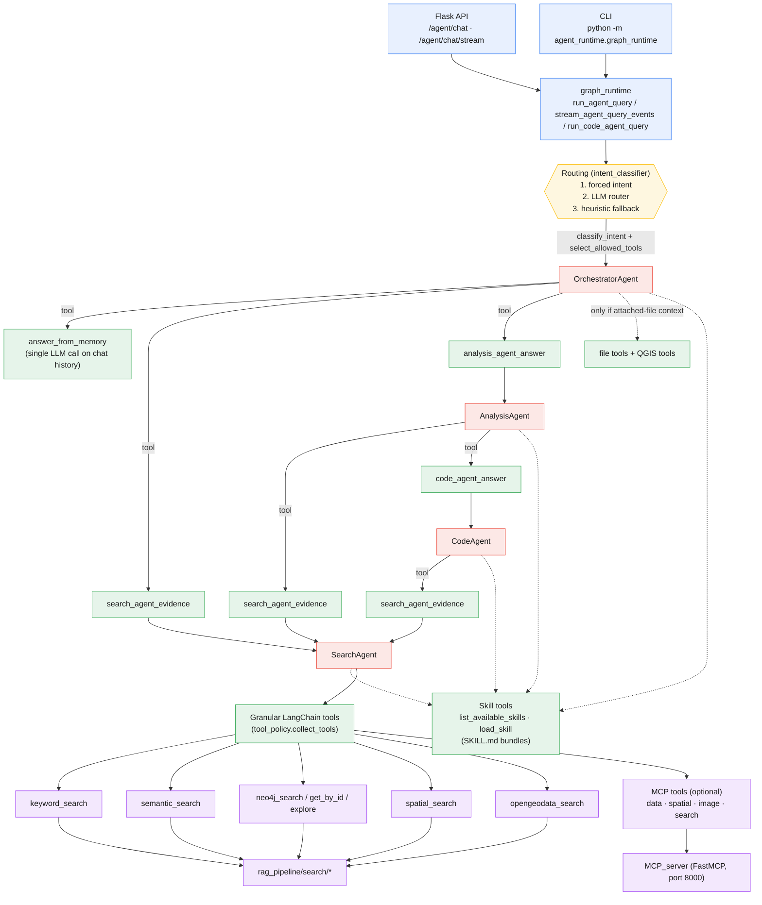
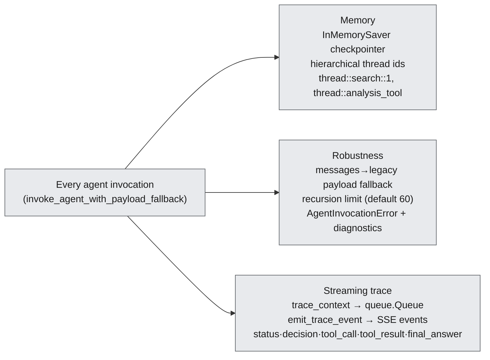

# I-GUIDE Multi-Agent System

The agent is a **recursive "agents-as-tools" hierarchy** built on LangChain
`create_agent` / `AgentExecutor`. Each sub-agent is wrapped as a `StructuredTool`,
so a parent delegates by calling a tool that internally spins up a child agent.
SearchAgent is the only leaf that reaches the real RAG search backends.

## Agent hierarchy & control flow



## Cross-cutting concerns



### Notes

- **Same tool, three depths.** `search_agent_evidence` appears under the
  Orchestrator, AnalysisAgent, and CodeAgent — SearchAgent can be reached at up to
  3 nesting levels (Orchestrator → Analysis → Code → Search). This is why the
  recursion-limit + diagnostics machinery exists.
- **Two tool strategies.** `granular` (per-backend tools, shown above) vs
  `full_pipeline` (a single `rag_tool` wrapping the whole RAG pipeline).
- **Two-layer tool selection.** `collect_tools` *instantiates* what's available;
  `select_allowed_tools` *filters* by intent (name-sets in `graph_state.py`).
- **Clean dependency direction.** `agent_runtime` never imports `rag_pipeline`
  directly; backends are reached only through the granular tool wrappers.
```
