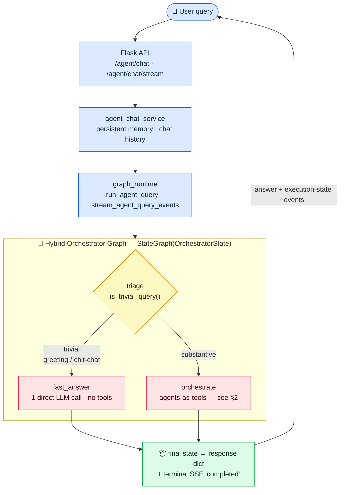
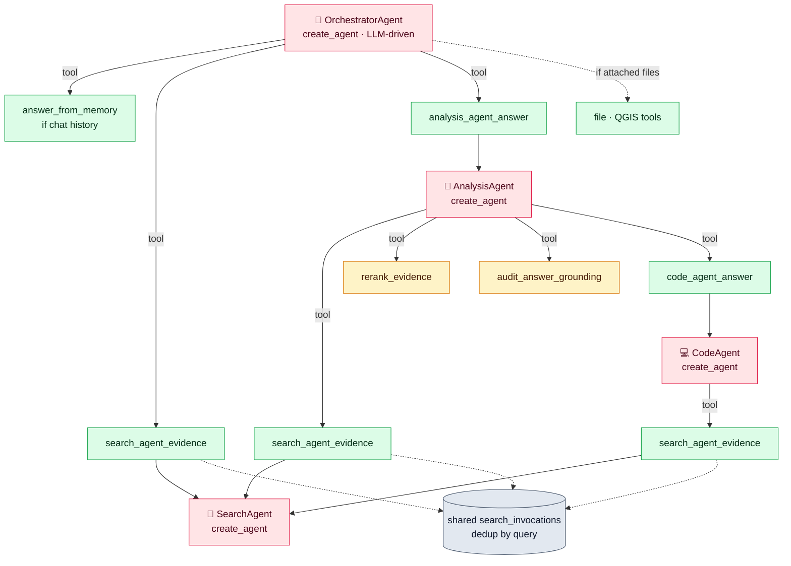
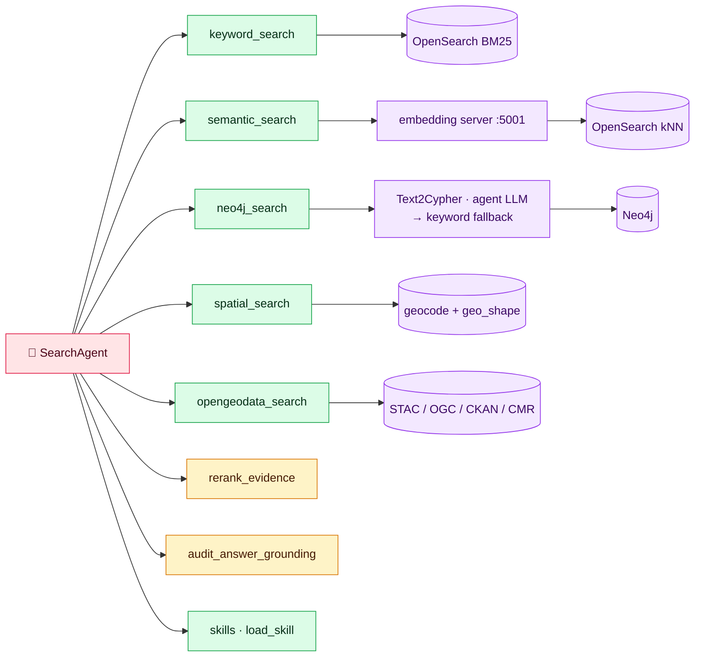
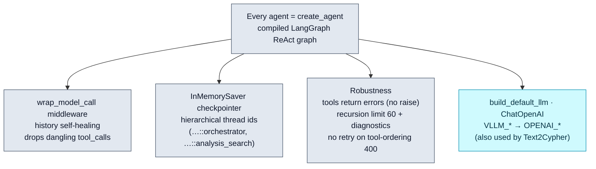
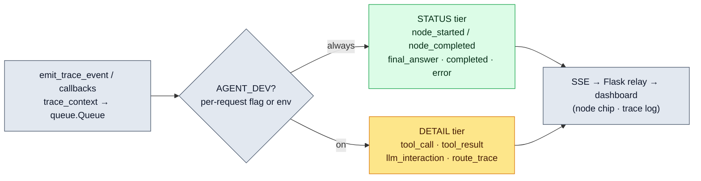
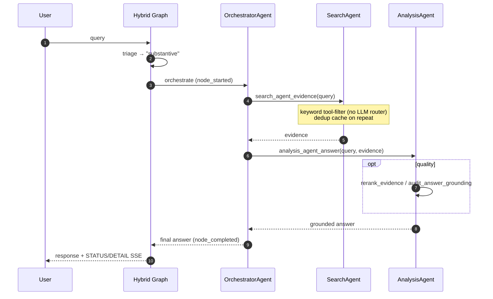

# I-GUIDE Agent — Architecture (as built, Phases 0–3)

A **hybrid LangGraph system**: a thin `StateGraph` triages each request and either
**fast-paths** trivial inputs (one direct LLM call) or hands substantive work to an
**LLM orchestrator** coordinating search / analysis / code sub-agents (every agent is a
`create_agent` graph). Cross-cutting: shared dedup'd evidence, self-healing history,
one unified LLM, and `AGENT_DEV`-gated execution-state streaming.

---

## 1 · Request lifecycle (hybrid graph)

---

## 2 · Orchestrate path — agents-as-tools

---

## 3 · SearchAgent tools & backends

---

## 4 · Cross-cutting runtime (every agent)

---

## 5 · Streaming tiers (`AGENT_DEV`)

---

## 6 · End-to-end sequence (substantive query)

---

### Legend
🧠 / 🔎 / 🧩 / 💻 agents (`create_agent`) · 🟩 tools · 🟨 quality (rerank/audit) ·
🟪 search backends · ⬜ runtime infra. Trivial queries skip §2–§3 entirely via the
fast path. `full_pipeline` / `rag_tool` remain only as a deprecated path (not shown).
